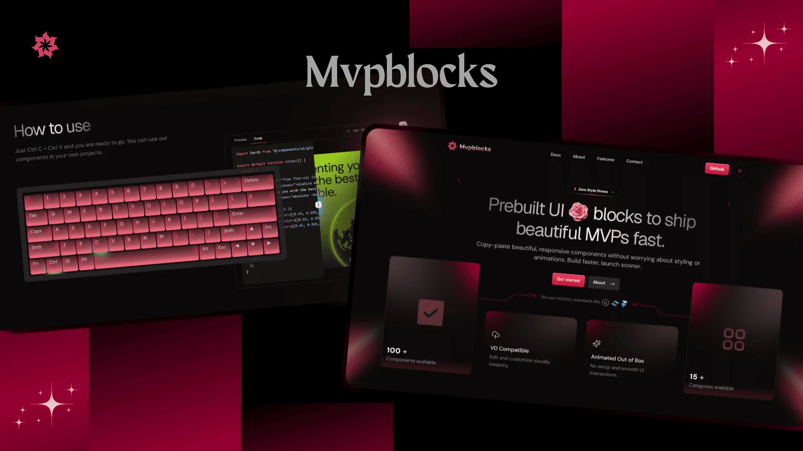

# 🧱 PetalUI 

**The Ultimate Open Source Component Library for MVPs.**  
Copy, paste, customize—and launch your idea faster than ever.

## ⚡ What is PetalUI?

PetalUI is a fully open-source, developer-first component library built using **Next.js** and **TailwindCSS**, designed to help you launch your MVPs in record time. No bloated packages, no unnecessary installs—just clean, copyable code to plug right into your next big thing.

Whether you're building a SaaS dashboard, a landing page, or a personal portfolio—PetalUI offers a curated set of reusable blocks designed to work beautifully right out of the box.

## 💎 What We Provide

We don't just give you UI blocks—we give you **freedom to build without friction**. Here's what you get with PetalUI:

- 🧑‍💻 **Developer-Friendly**  
  Tailored for developers to create and iterate fast, with minimal overhead and maximum flexibility.

- 🔧 **CLI Support**  
  Seamlessly integrate PetalUI into your workflow using our smart CLI support, optimized for speed and efficiency.

- 🎨 **Easily Customisable**  
  Every block is built to be editable. From layout to logic, style to structure—make it your own.

- 🚀 **v0 Support**  
  Even at version zero, you can launch fast with confidence. Ideal for MVPs, prototypes, and weekend hacks.

- 📚 **Fully Functional Docs Understanding**  
  Comprehensive documentation and inline guides help you quickly understand how to use, modify, or contribute components.

- 🖥️ **Multi Viewport**  
  Preview and copy blocks optimized for every screen size—from mobile to ultra-wide monitors.

- 🧩 **Easy-to-Use Interface**  
  Our web UI is intuitive, clean, and minimal. Preview, click, copy. That's it.

## 🌐 Explore PetalUI

Explore the complete component library to:

- 🔍 Browse through 200+ unique blocks
- 🎯 Filter by category (Auth, Dashboard, Hero, Pricing, and more)
- 📋 Copy with a single click
- 📘 Read full documentation

## 💬 Join the Community

Whether you have questions, ideas, or just wanna hang out—come join us!

- 🐙 [GitHub Discussions](https://github.com/tusharv2005/PetalUI/discussions)
- 📥 [Submit a Pull Request](https://github.com/tusharv2005/PetalUI/pulls)
- 🚨 [Report an Issue](https://github.com/tusharv2005/PetalUI/issues)

## 📜 Terms and Conditions

- You can freely use, modify, and copy blocks from PetalUI.
- Please don't use PetalUI content for piracy or unethical purposes.
- No need to contact us for using blocks—just give credit if possible.

## 🛡️ License

PetalUI is released under the [BSD 3-Clause License](./LICENSE).  
Use it commercially, personally, and freely. Just don't resell components as-is.

## 🌟 Open Source With ❤️

PetalUI is proudly open source and built by passionate developers.  
If you find it helpful:

- ⭐ **Star** the repo to show your support  
- 🛠 **Contribute** a block, idea, or fix  
- 🐞 **Raise an issue** if something's broken

Together, let's build a better internet—one block at a time.

---

**Built with ❤️ by tusharv2005 | PetalUI**
